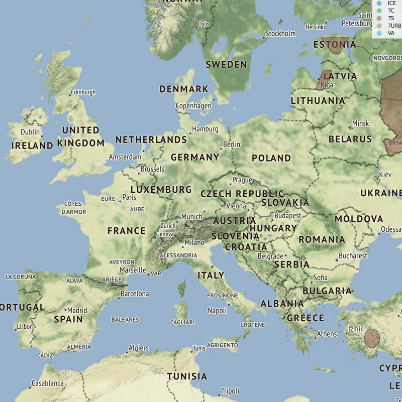
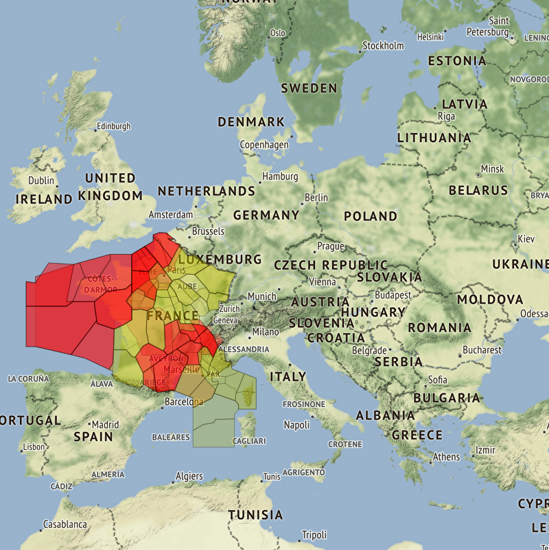

# SIGMET versus ATC sectors

Visualize SIGnificant METeorological informations (SIGMET) and the ATC sectors impacted on 2D maps with Python framework (geopandas, contextily, matplotlib...)

SIGMET data are loaded from json files or from a URL (NOAA web service)

Data are stored as [GeoPandas](http://geopandas.org/) dataframes

The map background is built with [contextily](https://github.com/darribas/contextily)

Plotting is realized with matplotlib

Example: SIGMETs over Europe on 16/03/2020

Example: French ATC sector volumes impacted by SIGMETs

## Running the tests

Run the demo_sigmet_sectors notebook to see how to load and plot SIGMET and ATC sectors

## Built With

* [pandas](https://pandas.pydata.org/) - Python Data Analysis Library

* [GeoPandas](http://geopandas.org/) - GeoPandas is an open source project which extends the datatypes used by pandas to allow spatial operations on geometric types. 

* [contextily](https://github.com/darribas/contextily) - Context geo-tiles in Python

## Authors

* **Thomas Dubot** 

## License

This project is licensed under the MIT License - see the [LICENSE.md](LICENSE.md) file for details

## Acknowledgments

Thanks to [NOAA](https://www.aviationweather.gov/) for providing such useful weather data